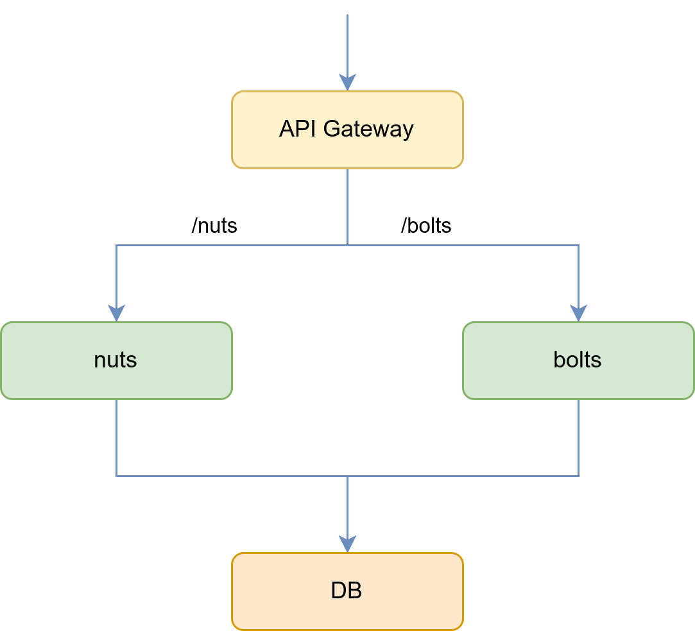

# Docker nuts'n'bolts



## Network

### Get containers IP addresses

```shell
$ docker network inspect -f '{{json .Containers}}' nutsnbolts-net
```
output:
```json
{
    "3186d8e2b3b3a5e4c1155655c6ef5c1f7d2aa1233eb0318151da62ec51beebf9": {
        "Name": "capps-bolts-1",
        "EndpointID": "edd90a3e70c9dc38aa94390b7140c3ca5b631e995f9abad9ac623a8a5d8f2445",
        "MacAddress": "02:42:c0:a8:80:05",
        "IPv4Address": "192.168.128.5/20",
        "IPv6Address": ""
    },
    "3c14a76a285de928578ee3a1f7936c2ff8955102c73e7bbbc2424a9208f458e4": {
        "Name": "capps-apigateway-1",
        "EndpointID": "e29fec028a6747a2a3e6ac9d48aeaca51a2595d38b5a9ae70f744778f2f74840",
        "MacAddress": "02:42:c0:a8:80:02",
        "IPv4Address": "192.168.128.2/20",
        "IPv6Address": ""
    },
    "c28b8b7612c61ffa1a0d400d1064db3c863ae10abe44453354f59bb3f1966e04": {
        "Name": "capps-nuts-1",
        "EndpointID": "af6decd8acd3c2a8cae1c50257a526d17507f2f2c8f16cf8acec0f132e042f54",
        "MacAddress": "02:42:c0:a8:80:04",
        "IPv4Address": "192.168.128.4/20",
        "IPv6Address": ""
    },
    "c508cbb6159f20de4d97d13ff8852776f69dc4d8c6122919799704a978908e51": {
        "Name": "capps-db-1",
        "EndpointID": "fe8747d4b70ed68fe7fa89c9f8eeec290b7f7f3c7435eb5737fb564994c09beb",
        "MacAddress": "02:42:c0:a8:80:03",
        "IPv4Address": "192.168.128.3/20",
        "IPv6Address": ""
    }
}
```

# Installation

```bash
make build-all
```

# Start

```bash
cd capps
docker-compose up
```

Running capps for the first time will create db initialization and migrations, so it might be required
to restart docker-compose for other services to catch up.

# Calling services

## Using API Gateway

```bash
curl http://localhost/nuts/ping
curl http://localhost/nuts/counter
```

```bash
curl http://localhost/bolts/ping
curl http://localhost/bolts/counter
```

## Using Envoy Proxy

```bash
curl http://localhost:10000/nuts/ping
curl http://localhost:10000/nuts/counter
```

```bash
curl http://localhost:10000/bolts/ping
curl http://localhost:10000/bolts/counter
```
